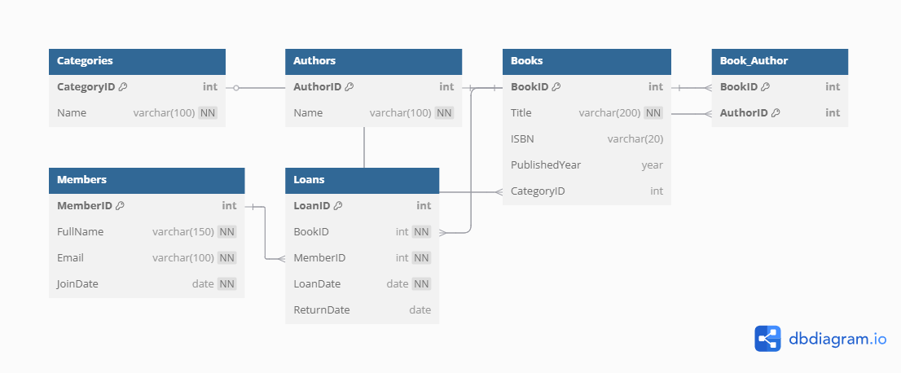

# 📚 Library Management System (MySQL)

## 📌 Description
This project is a full-featured Library Management System database designed using MySQL. It models books, authors, members, loans, and book categories.

## ⚙️ How to Run / Set Up
1. Clone this repository.
2. Open your MySQL client (e.g., MySQL Workbench or phpMyAdmin).
3. Import the `library_management.sql` file to create the database schema.
4. You can now populate it with sample data or integrate it with a front-end application.

## 🧩 Entity-Relationship Diagram

The png file is the ERD 

## 🧠 Project Scope (Question 1)
This repo contains:
- ✅ One `.sql` file with fully-commented `CREATE TABLE` statements
- ✅ README with instructions and ERD

